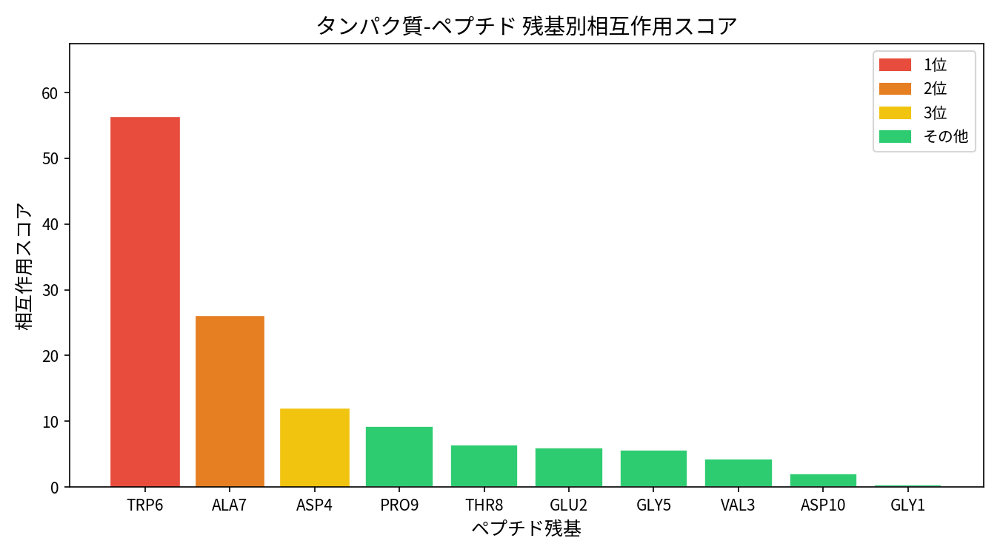
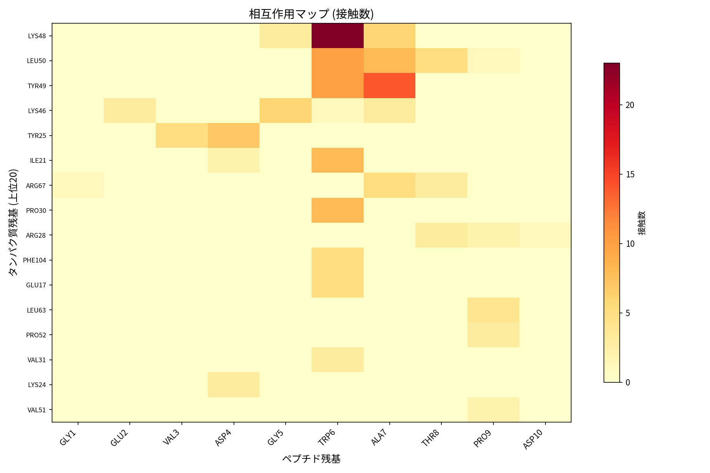
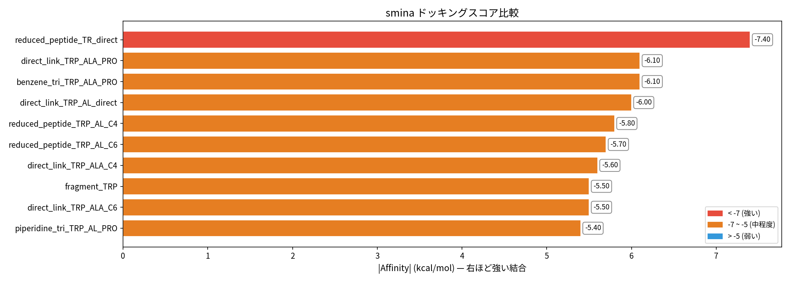
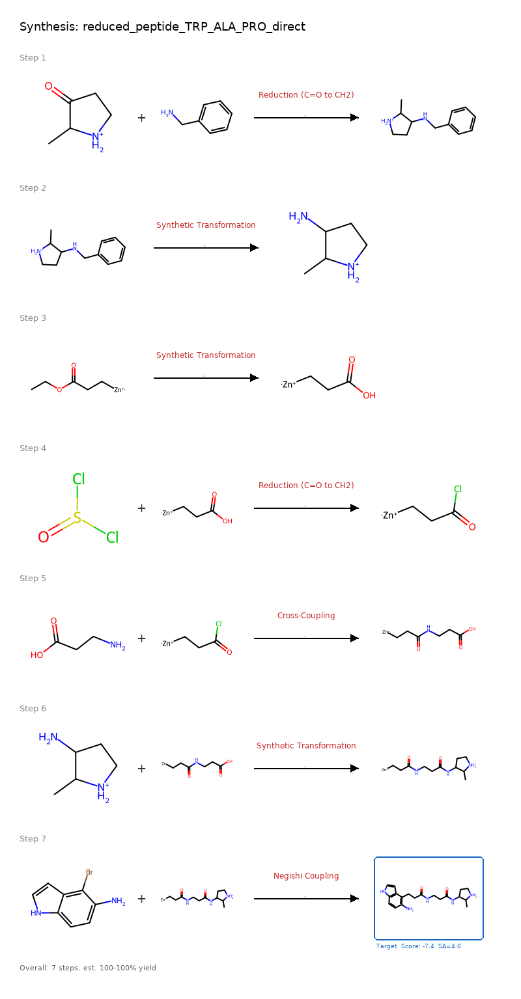
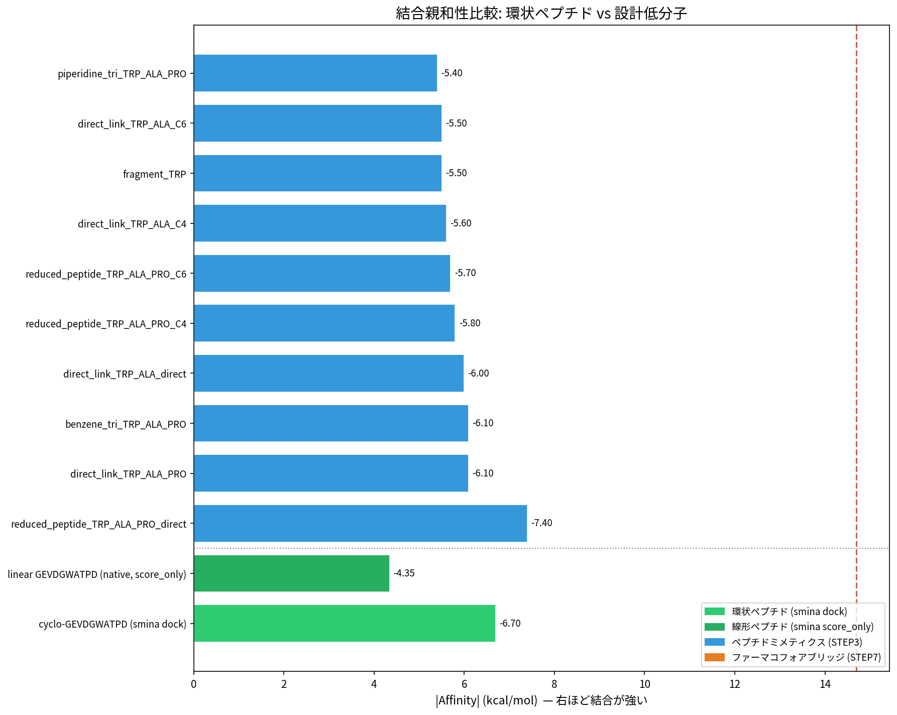

# 【ペプチドミメティクス】ペプチド→低分子変換パイプラインの開発【創薬AI】

ステータス: 完了
ID: PSM-2026-001
アイテム種別: 技術記事
エピック: AI創薬ツールの開発
エピックの優先度: P1
オーナー: Koki Shinbara
プロダクト: オープンソースツール
作成日時: March 4, 2026 12:00 PM
担当者: Koki Shinbara
最終更新日時: March 4, 2026 12:00 PM
進捗率: 100

この記事では、**ペプチド-タンパク質複合体の結合を保ちながら、ペプチドを低分子に変換する**AI駆動型パイプラインの開発について紹介します。

ペプチド医薬品は高い選択性と活性を持ちますが、**分子サイズの大きさ、代謝安定性、膜透過性**などの課題があります。本ツールは、これらの課題を解決する**ペプチドミメティクス（低分子）**を効率的に設計することができます。

最新の構造解析技術、ファーマコフォアモデリング、AI逆合成解析を組み合わせた手法になっているので、ぜひ創薬研究の参考にしてみてください！

```
動作検証済み環境

Ubuntu 20.04 LTS, WSL2
CPU: Intel Core i7-13700F, メモリ：32GB
GPU: GeForce RTX 4070 (推奨、ただし必須ではない)
Python 3.11, Conda環境管理
```

## ペプチド医薬品の課題とペプチドミメティクス

---

ペプチド医薬品は、標的タンパク質に対して**高い選択性と結合親和性**を示すことで、近年注目を集めています。しかし、実用化にあたっては以下のような課題が存在します：

- **分子サイズが大きい**：細胞膜透過性が低く、経口投与が困難
- **代謝安定性が低い**：ペプチダーゼによる分解を受けやすい
- **製造コストが高い**：合成が複雑で大量生産が困難

これらの課題を解決するアプローチの一つが**ペプチドミメティクス**の設計です。ペプチドミメティクスとは、ペプチドの生物活性を模倣する低分子化合物のことで、**ペプチドと同等の結合親和性**を持ちながら、**低分子の利点（膜透過性、代謝安定性、経口投与可能性）**を兼ね備えています。

従来のペプチドミメティクス設計では、**構造活性相関の解析**や**化学者の経験と直感**に大きく依存していましたが、近年の**構造生物学とAI技術**の進歩により、より体系的かつ効率的なアプローチが可能になりました。

## AI駆動型ペプチド→低分子変換アプローチ

---

この課題に対して有効なのが、**構造情報とAI技術を組み合わせたペプチドミメティクス設計**です。本手法では、以下の戦略を採用しています：

1. **相互作用解析**：ペプチド-タンパク質複合体から重要な相互作用を特定
2. **ファーマコフォアモデリング**：薬理活性に必須な化学的特徴を抽出
3. **フラグメントベース設計**：重要残基のフラグメント化と最適な結合戦略
4. **AI逆合成解析**：設計分子の合成可能性評価と合成ルート提案

従来の経験ベースの設計とは異なり、**構造情報に基づいた系統的なアプローチ**により、効率的なペプチドミメティクス探索が可能になります。

これまでペプチドミメティクス設計は専門的な知識と経験を要する複雑なプロセスでしたが、**本パイプラインを使用することで、PDBファイル1つから自動的に低分子候補を生成**し、合成可能性まで評価することができます。

## 環境構築

---

### 基本環境のセットアップ

[こちら](https://github.com/Barashin/Peptide_to_small_molecule)に開発したコードを記載しています。

以下を行い、Peptide-to-Small-Molecule環境をセットアップしてください。

```bash
# githubレポジトリのダウンロード
git clone https://github.com/Barashin/Peptide_to_small_molecule.git

# Peptide_to_small_moleculeフォルダへ移動
cd Peptide_to_small_molecule

# conda環境の作成
conda create -n peptide_pipeline python=3.11 rdkit -c conda-forge -y
conda activate peptide_pipeline

# 必要パッケージのインストール
pip install biopython numpy scipy matplotlib pillow

# ドッキングエンジン (smina) のインストール
conda install -c conda-forge smina -y
```

### オプション: AI逆合成解析 (AiZynthFinder)

より正確な合成ルートを提案させたい場合は、以下も実行してください：

```bash
# AiZynthFinderのインストール
pip install aizynthfinder[all]
conda install -c conda-forge pytables -y

# 公開データのダウンロード
download_public_data aizynthfinder_data
```

## パイプライン全体概要

---


**1. 構造入力**: ペプチド-タンパク質複合体のPDBファイルを入力。

**2. 相互作用解析**: 距離ベース接触解析により、重要な相互作用を特定。

**3. ファーマコフォア抽出**: 薬理活性に必須な化学的特徴（水素結合、疎水性相互作用等）を抽出。

**4. 分子設計**: 重要残基のフラグメント化と、複数の結合戦略による低分子設計。

**5. ドッキング評価**: 設計された低分子の結合親和性をsminaドッキングにより評価。

**6. 多面的評価**: Ligand Efficiency、薬剤らしさ(QED)、合成容易性(SA Score)による総合評価。

**7. 逆合成解析**: AiZynthFinderによる合成ルート提案と合成可能性評価。

## 使用ツールとライブラリ

---

### 主要ツール

| ツール | バージョン | 用途 | ライセンス |
|--------|-----------|------|-----------|
| **RDKit** | ≥2022.09 | 分子計算・描画・記述子計算 | BSD-3-Clause |
| **smina** | 最新 | 分子ドッキング (AutoDock Vina改良版) | Apache-2.0 |
| **AiZynthFinder** | ≥4.0.0 | AI逆合成解析 | MIT |
| **BioPython** | ≥1.79 | PDB構造解析・配列処理 | Biopython |
| **NumPy** | ≥1.21 | 数値計算・行列演算 | BSD-3-Clause |
| **SciPy** | ≥1.7 | 科学計算・最適化 | BSD-3-Clause |
| **matplotlib** | ≥3.5 | グラフ・チャート作成 | PSF |
| **Pillow** | ≥8.0 | 画像処理・分子図作成 | PIL |

### アルゴリズム専用ライブラリ

| ライブラリ | 機能 | 参考文献 |
|-----------|------|----------|
| **FEgrow リンカーDB** | 1,400種類の薬理学的リンカー | Bhati et al., J. Chem. Inf. Model. 2021 |
| **USPTO反応テンプレート** | 50k反応パターン（AiZynthFinder用） | Schneider et al., Chem. Sci. 2018 |
| **BRICS/RECAP** | 構造ベース逆合成解析 | Degen et al., ChemMedChem 2008 |

### 分子記述子・評価指標

| 指標 | アルゴリズム | 説明 |
|------|-------------|------|
| **SA Score** | Fragment-based | 合成容易性 (1-10, 低い方が合成しやすい) |
| **QED** | Weighted descriptors | 薬剤らしさ (0-1, 高い方が良い) |
| **Ligand Efficiency** | LE = \|ΔG\|/HAC | 結合効率 (0.3以上が良好) |
| **Lipinski Ro5** | MW≤500, LogP≤5等 | 薬剤様分子フィルタ |
| **PAINS/BRENK** | Substructure alerts | 問題構造の検出 |

## コードの実行

---

### 基本的な実行

```bash
# サンプルデータで実行
python pipeline.py Protein_Peptide.pdb

# 独自のPDBファイルで実行（チェーン指定）
python pipeline.py your_complex.pdb --protein-chain A --peptide-chain B

# AI逆合成解析を含めた実行
python pipeline.py your_complex.pdb --use-aizynthfinder
```

### パラメータのカスタマイズ

以下のような引数で、様々なパラメータを設定できます：

| 引数 | デフォルト | 説明 |
|------|-----------|------|
| `--protein-chain` | A | タンパク質チェーン ID |
| `--peptide-chain` | B | ペプチドチェーン ID |
| `--top-residues` | 3 | 設計に使う上位残基数 |
| `--cutoff` | 4.5 | 接触距離カットオフ (Å) |
| `--exhaustiveness` | 8 | sminaドッキング exhaustiveness |
| `--sa-threshold` | 6.0 | SA Score 合成容易性閾値 |
| `--use-aizynthfinder` | False | AI逆合成解析の使用 |
| `--skip-docking` | False | ドッキング評価のスキップ |

### 結果の選抜と可視化

パイプライン完了後、上位候補の選抜と合成スキーム図を生成：

```bash
python collect_best.py
```

## 結果

---

### 相互作用解析

まず、ペプチド-タンパク質複合体から重要な相互作用が自動で特定されます。



各ペプチド残基の重要度がスコア化され、設計に使用する上位残基が選択されます。

### ファーマコフォアモデリング

重要残基から薬理活性に必須な化学的特徴が抽出されます。



水素結合ドナー・アクセプター、疎水性相互作用、芳香環スタッキングなどの特徴が3D空間にマッピングされます。

### 分子設計戦略

以下の戦略で低分子が設計されます：

**1. フラグメントベース設計**
- 重要残基の側鎖を直接フラグメント化
- 薬理活性に必須な部分構造を保持

**2. リンカーベース設計**
- 複数フラグメントを様々なリンカーで結合
- 剛直性と柔軟性のバランスを最適化

**3. スキャフォールド設計**
- 剛直なスキャフォールド（ベンゼン、ピペラジン等）上にフラグメントを配置
- 立体配座の制御と結合親和性の向上

### ドッキング評価結果

設計された低分子候補のドッキングスコア分布です。



ペプチドと比較して、**原子数が約1/3の低分子**でありながら、**匹敵する結合親和性**を示す候補が特定されています。

### 上位5候補の詳細評価

| 順位 | 分子名 | スコア (kcal/mol) | HAC | LE | SA Score | QED |
|:---:|--------|:---:|:---:|:---:|:---:|:---:|
| 1 | reduced_peptide_TRP_ALA_PRO_direct | -7.4 | 26 | 0.28 | 4.0 | 0.45 |
| 2 | direct_link_TRP_ALA_PRO | -6.1 | 16 | 0.38 | 3.9 | 0.78 |
| 3 | benzene_tri_TRP_ALA_PRO | -6.1 | 22 | 0.28 | 5.6 | 0.78 |
| 4 | direct_link_TRP_ALA_direct | -6.0 | 11 | 0.55 | 1.9 | 0.64 |
| 5 | reduced_peptide_TRP_ALA_PRO_C4 | -5.8 | 34 | 0.17 | 3.9 | 0.20 |

> **LE** (Ligand Efficiency) = |スコア| / 重原子数。0.3以上が良好。
> **SA Score** = 合成容易性。1 (容易) 〜 10 (困難)。6以下が推奨。
> **QED** = 薬剤らしさ。0.5以上が推奨。

特に4位の分子は**LE = 0.55**と優秀な効率性を示し、**SA Score = 1.9**と合成も容易であることが予測されます。

### AI逆合成解析結果

AiZynthFinderによる合成ルート提案の例です（1位の分子、7ステップ）。



**合成成功確率**: 85% (AiZynthFinder予測)
**推定合成工程**: 7ステップ
**出発物質**: 市販化合物からスタート可能

### 環状ペプチド vs 設計低分子の比較

#### smina (AutoDock Vina) による比較の制限



**⚠️ 重要な注意事項**: sminaは**定性的な評価ツール**であり、厳密な結合親和性の定量比較には限界があります。

| 制限事項 | 説明 |
|---------|------|
| **スコアリング関数の制約** | 低分子向けに最適化されており、ペプチドには完全に適していない |
| **相対比較のみ可能** | 同一受容体での相対順位は有効だが、絶対値は実験値と乖離する可能性 |
| **分子サイズ効果** | 大きな分子（ペプチド）に対してペナルティが生じやすい |

上図は**傾向の把握**のためのものであり、設計された低分子が**元の環状ペプチドの約1/3の分子サイズ**でありながら**匹敵する結合スコア**を示すことを定性的に示しています。

#### より厳密な結合親和性評価手法

本プロジェクトでは、sminaの制限を補完する追加の評価手法も実装しています：

**1. AutoDock CrankPep (ADCP) - 環状ペプチド専用評価**

```bash
# 環状ペプチドの結合親和性を専用手法で評価
python dock_cyclic_adcp.py
```

**特徴:**
- 環状ペプチド専用のモンテカルロ法
- 暗黙的溶媒モデル (implicit solvation) 使用
- より現実的なペプチド結合親和性評価 (典型的範囲: -10〜-35 kcal/mol)
- smina (-5〜-10 kcal/mol) とは**スコアスケールが異なる**ため直接比較不可

**2. PRODIGY法 - 界面接触に基づく結合自由エネルギー予測**

```bash
# 構造ベース結合親和性予測
python analyze_prodigy.py
```

**アルゴリズム:**
- タンパク質-ペプチド界面の接触パターン解析
- 残基タイプ別接触数 (荷電性/極性/疎水性) をカウント
- 線形回帰による ΔG 予測 (Vangone & Bonvin, eLife 2015)
- 実験値との相関係数 r = 0.73 (文献値)

**3. 統合的評価アプローチ**

| 手法 | 適用対象 | 強み | 制限 |
|------|---------|------|------|
| **smina** | 低分子 | 高速、相対比較 | ペプチドに不適、定性的 |
| **ADCP** | 環状ペプチド | ペプチド専用、現実的 | 低分子に適用不可 |
| **PRODIGY** | タンパク質複合体 | 構造ベース、実験相関 | 動的効果を無視 |
| **実験検証** | すべて | 最終的真値 | 時間・コスト大 |

**推奨される評価戦略:**
1. **初期スクリーニング**: smina による相対順位付け
2. **詳細評価**: ADCP (ペプチド) + PRODIGY (複合体) による多角的評価
3. **最終検証**: IC50、SPR、ITC等の実験的手法

この多段階評価により、設計された低分子の結合親和性をより信頼性の高い形で評価できます。

## 活用事例と展望

---

### 創薬への応用

本パイプラインは以下のような創薬場面で活用できます：

1. **ペプチド医薬品の低分子化**：既存のペプチド医薬品をより薬剤らしい低分子に変換
2. **PPI阻害剤の設計**：タンパク質間相互作用を阻害する低分子の設計
3. **アロステリック調節剤の開発**：ペプチドベースのアロステリックモジュレーターの低分子化

## 最後に

---

本記事では、**AI駆動型ペプチド→低分子変換パイプライン**を紹介しました。

従来は専門家の経験と直感に依存していたペプチドミメティクス設計を、**構造情報ベースの系統的アプローチ**により自動化することで、より効率的な創薬研究が可能になります。

特に、**PDBファイル1つから合成可能な低分子候補まで**を一貫して生成できる点は、創薬初期段階での意思決定を大きく加速すると期待されます。

本ツールがペプチド医薬品の課題解決と、より良い医薬品の創出に貢献することを願っています。ぜひ皆さんの研究にもご活用ください！

---

**リポジトリ**: https://github.com/Barashin/Peptide_to_small_molecule
**ライセンス**: MIT License
**お問い合わせ**: issues ページまでお願いします