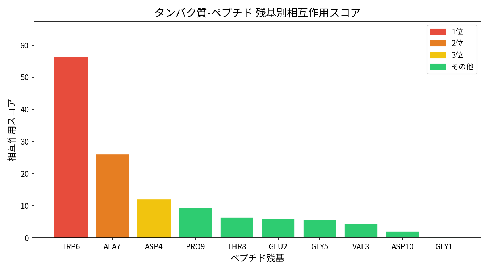
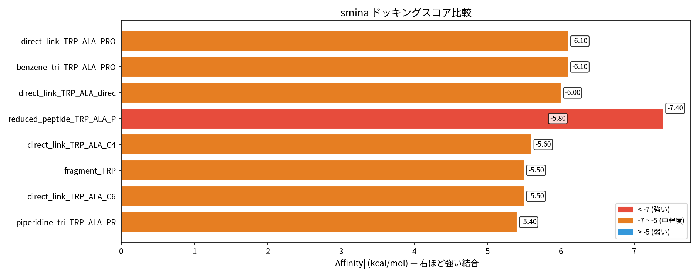

# Peptide to Small Molecule

ペプチド-タンパク質複合体の結合を保ちながら、ペプチドを低分子に変換するツールです。

---

## 基本環境のセットアップ

こちらに開発したコードを記載しています。

以下を行い、Peptide-to-Small-Molecule環境をセットアップしてください。

```bash
# githubレポジトリのダウンロード
git clone https://github.com/Barashin/Peptide_to_small_molecule.git

# プロジェクトディレクトリに移動
cd Peptide_to_small_molecule
```

---

## 1. 環境構築

```bash
# conda 環境を作成
conda create -n peptide_pipeline python=3.11 rdkit -c conda-forge -y
conda activate peptide_pipeline

# 必要パッケージをインストール
pip install biopython numpy scipy matplotlib pillow

# ドッキングエンジン (smina) をインストール
conda install -c conda-forge smina -y
```

### オプション: AI 逆合成 (AiZynthFinder)

より正確な合成ルートを提案させたい場合:

```bash
pip install aizynthfinder[all]
conda install -c conda-forge pytables -y
download_public_data aizynthfinder_data
```

---

## 2. 必要な入力

**PDB ファイル 1 つだけ** — タンパク質とペプチドが別チェーンで入った複合体構造。

サンプルファイル `Protein_Peptide.pdb` が同梱されているので、そのまま試せます。

---

## 3. 実行

```bash
conda activate peptide_pipeline

# サンプルで実行
python pipeline.py Protein_Peptide.pdb

# 自分の PDB で実行 (チェーン指定)
python pipeline.py my_complex.pdb --protein-chain A --peptide-chain B

# AI 逆合成を使う場合
python pipeline.py input.pdb --use-aizynthfinder
```

パイプライン完了後、上位候補の選抜と合成スキーム図を生成:

```bash
python collect_best.py
```

---

## 4. 結果

### `results/` — 全解析結果

- `contacts.json` — 相互作用データ
- `residue_scores.png` — 残基重要度グラフ
- `candidate_ligands.sdf` — 候補分子
- `docking/` — ドッキング結果 (スコア一覧 CSV + ポーズ SDF)

### `Result_Best/` — 上位 5 候補

- `*.sdf` — 選抜分子のドッキングポーズ (PyMOL で可視化)
- `summary.csv` — スコア・物性データ一覧
- `retrosynthesis/` — 合成スキーム図 (PNG) + HTML レポート

---

## 5. アウトプット例

サンプル PDB (`Protein_Peptide.pdb`) での実行結果です。

### 相互作用解析 — 残基重要度ランキング

ペプチドの各残基がタンパク質との結合にどれだけ重要かをスコア化します。



### 相互作用マップ

ペプチド残基とタンパク質残基の接触数をヒートマップで表示します。


### ドッキングスコア

設計された候補分子のドッキングスコア (kcal/mol) の比較です。値が小さいほど結合が強いことを示します。



### 上位 5 候補 (Result_Best)

| 順位 | 分子名 | スコア (kcal/mol) | LE | SA Score |
|:---:|--------|:---:|:---:|:---:|
| 1 | reduced_peptide_TRP_ALA_PRO_direct | -7.4 | 0.28 | 3.99 |
| 2 | direct_link_TRP_ALA_PRO | -6.1 | 0.38 | 3.88 |
| 3 | benzene_tri_TRP_ALA_PRO | -6.1 | 0.28 | 5.58 |
| 4 | direct_link_TRP_ALA_direct | -6.0 | 0.55 | 1.88 |
| 5 | reduced_peptide_TRP_ALA_PRO_C4 | -5.8 | 0.17 | 3.92 |

> **LE** (Ligand Efficiency) = |スコア| / 重原子数。0.3 以上が良好。
> **SA Score** = 合成容易性。1 (容易) 〜 10 (困難)。

### 環状ペプチド vs 設計低分子 — 結合親和性比較 (smina)

同じスコアリング関数 (smina / Vina スコア) で環状ペプチドと設計低分子を比較します。低分子は原子数が約 1/3 にもかかわらず、環状ペプチドに匹敵する結合スコアを示しています。


### 合成スキーム図 (AiZynthFinder)

AI が提案した前向き合成ルートの例です (1 位の分子、7 ステップ)。


---

## 6. 高度な機能

メインパイプライン以外にも、創薬研究における様々なニーズに対応した専門的な分子設計・評価機能を提供しています。

### 6.1 ポケット分子生成 (Pocket-Complementary Design)

**概要**: タンパク質結合ポケットの物理化学的性質を解析し、その特性に相補的な低分子リガンドを系統的に設計します。

**理論的背景**:
- ポケット残基の電荷・疎水性・芳香族性を統計的に解析
- 相補的相互作用の原理（正電荷 ↔ 負電荷、疎水性 ↔ 疎水性、π-π スタッキング）に基づく設計
- Anchor（結合コア）+ Scaffold（骨格）+ Decorator（修飾基）の階層的組み立て

```bash
# 基本実行
python generate_pocket_molecules.py

# ポケット解析のみ（分子生成スキップ）
python generate_pocket_molecules.py --analyze-only

# 特定残基タイプに重点を置いた設計
python generate_pocket_molecules.py --focus-type ARO  # 芳香族重視

# カスタムポケット定義
python generate_pocket_molecules.py --pocket-residues LYS48,PHE50,TRP52
```

**分子設計戦略**:

| ポケット残基タイプ | 相補的リガンド特徴 | 使用フラグメント例 |
|-------------------|-------------------|-------------------|
| **正電荷** (LYS/ARG) | アニオン性基 | COOH, SO₃H, テトラゾール, リン酸 |
| **負電荷** (ASP/GLU) | カチオン性基 | 1級アミン, グアニジン, アミジン |
| **芳香族** (TYR/PHE/TRP) | π-π スタッキング | ベンゼン, インドール, ピリジン |
| **疎水性** (LEU/ILE/VAL) | 疎水性コア | シクロヘキシル, アルキル鎖 |
| **極性** (SER/THR/ASN) | 水素結合基 | ヒドロキシル, カルボニル, アミド |

**出力データ**:
- `results/pocket_analysis.json` — ポケット統計データ
- `results/candidate_pocket_ligands.sdf` — 設計分子（ドッキング準備済み）
- `results/pocket_profile.png` — ポケット特性の可視化

### 6.2 剛直スキャフォールド設計 (Rigid Scaffold Design)

**概要**: 既知の剛直分子骨格を活用して、ファーマコフォア点間距離を正確に制御した低分子を設計します。柔軟なリンカーでは達成困難な精密な空間配置が可能です。

**理論的背景**:
- 剛直スキャフォールドによるエントロピー損失の最小化
- 予定義された骨格ライブラリからの距離ベース選択
- コンフォメーション適合性スコアによる品質評価

```bash
# 基本的な2点間ブリッジ設計
python rigid_scaffold_design.py --point1 LYS48 --point2 LEU50

# カスタム距離制約
python rigid_scaffold_design.py --point1 TYR49 --point2 PRO52 --target-distance 8.5

# 利用可能スキャフォールドの一覧表示
python rigid_scaffold_design.py --list-scaffolds

# ドッキングをスキップして分子生成のみ
python rigid_scaffold_design.py --point1 LYS48 --point2 LEU50 --no-dock

# コンフォメーション解析詳細モード
python rigid_scaffold_design.py --point1 TRP46 --point2 ALA49 --conformer-analysis
```

**使用可能な剛直スキャフォールド**:

| スキャフォールド | 適用距離範囲 (Å) | 特徴 | 薬理活性例 |
|-----------------|------------------|------|-----------|
| **ベンゼン** | 2.8, 4.8, 7.0 | 平面、芳香族 | 多くの医薬品コア |
| **ナフタレン** | 3.8, 6.2, 8.4 | 拡張芳香族 | 抗炎症薬 |
| **インドール** | 4.2, 7.8 | 複素環、HBD | トリプタン系薬剤 |
| **ピペラジン** | 2.9, 5.8 | 塩基性、フレキシブル | 抗精神病薬 |
| **ノルボルナン** | 3.2, 6.1 | 立体剛直、疎水性 | 脂溶性向上 |

**コンフォメーション品質評価**:
- **Conformance Rate**: 低エネルギーコンフォマーのうちファーマコフォア距離許容範囲内の割合 (0-1, 高いほど良好)
- **Rotatable Between**: ファーマコフォア点間の回転可能結合数 (少ないほど剛直)

### 6.3 SASA (溶媒接触表面積) 解析

**概要**: Shrake & Rupley アルゴリズムによるSASA計算で、タンパク質-ペプチド結合界面のホットスポット残基を定量的に同定します。

**理論的背景**:
- ΔSASA = SASA(単体) - SASA(複合体): 結合により埋没した表面積
- 大きなΔSASAを持つ残基 = 結合に重要なホットスポット
- 界面接触の定量化による客観的重要度評価

```bash
# 基本SASA解析
python analyze_sasa.py Protein_Peptide.pdb

# チェーン指定
python analyze_sasa.py my_complex.pdb --protein-chain A --peptide-chain B

# ホットスポット閾値の調整
python analyze_sasa.py input.pdb --hotspot-threshold 15.0 --core-threshold 30.0

# 詳細レポート生成
python analyze_sasa.py input.pdb --detailed-report

# CSVエクスポート
python analyze_sasa.py input.pdb --export-csv results/sasa_analysis.csv
```

**SASA解析の判定基準**:

| ΔSASA 値 (Ų) | 分類 | 意味 | 設計における重要度 |
|--------------|------|------|-------------------|
| **0-5** | 非界面 | 結合に関与しない | 低 |
| **5-15** | 界面残基 | 結合界面に位置 | 中 |
| **15-30** | ホットスポット | 結合に重要 | 高 |
| **30+** | コアホットスポット | 結合に必須 | 最高 |

**出力データ**:
- `results/sasa_analysis.json` — 残基別SASA詳細データ
- `results/sasa_comparison.png` — ホットスポット可視化
- `results/hotspot_residues.csv` — ホットスポット残基一覧

### 6.4 ファーマコフォアブリッジ設計

**概要**: ユーザーが指定した2つのタンパク質残基間を結ぶ低分子ブリッジを、ファーマコフォア制約下で精密に設計します。

**アルゴリズム詳細**:
1. **距離測定**: 指定残基のCβ座標間距離を計算
2. **アンカー選択**: 各残基タイプに相補的な官能基を選択
3. **リンカー選択**: FEgrow ライブラリから最適距離のリンカーを選択
4. **3D制約埋め込み**: RDKit距離幾何学による制約付きコンフォメーション生成
5. **MMFF最適化**: 分子力学による構造精密化

```bash
# 基本的な2点ブリッジ設計
python pharmacophore_bridge.py --point1 LYS48 --point2 LEU50

# 3点結合（トライアングル）
python pharmacophore_bridge.py --point1 LYS48 --point2 LEU50 --point3 TYR49

# 利用可能な残基ペア表示
python pharmacophore_bridge.py --list-pairs

# コンフォメーション数の調整
python pharmacophore_bridge.py --point1 ARG46 --point2 PRO52 --n-confs 100

# 距離許容範囲の調整
python pharmacophore_bridge.py --point1 TRP49 --point2 ALA51 --tolerance 2.0
```

**距離制約の計算**:
```python
# 必要リンカー長の算出
Cβ_distance = |Cβ₁ - Cβ₂|  # 実測距離
anchor_reach = reach₁ + reach₂  # アンカー基のリーチ
needed_linker = Cβ_distance - anchor_reach  # 必要リンカー長

# FEgrowライブラリからの選択
suitable_linkers = [L for L in FEgrow_DB
                   if |L.length - needed_linker| ≤ tolerance]
```

### 6.5 多角的ドッキング評価システム

**概要**: 複数の独立したドッキングエンジンと結合親和性予測手法を用いて、分子の結合能を多角的に評価し、手法間のバイアスを除去します。

#### AutoDock CrankPep (ADCP) - 環状ペプチド専用評価

```bash
# 環境セットアップ（初回のみ）
bash adcpsuite_micromamba.sh

# レセプター準備（初回のみ）
python dock_cyclic_adcp.py --setup-receptor

# 通常のペプチドドッキング
python dock_cyclic_adcp.py

# クイックテスト
python dock_cyclic_adcp.py --quick

# カスタム配列での評価
python dock_cyclic_adcp.py --sequence "ACDEFGHIJK"
```

**ADCP の特徴**:
- 環状ペプチド専用のモンテカルロ法
- GB/SA implicit溶媒モデル
- ペプチドの柔軟性を正確にモデル化
- 典型的スコア範囲: -10〜-35 kcal/mol

#### AutoDock FR (ADFR) - 物理ベース低分子評価

```bash
# 上位候補のADFR評価
python dock_smol_adfr.py

# 処理件数の制限
python dock_smol_adfr.py --top-n 10

# クイックテスト
python dock_smol_adfr.py --quick
```

**ADFRの特徴**:
- AutoDock力場（静電相互作用、脱溶媒化項を含む）
- sminaより物理化学的に妥当
- ADCP と同じ .trg ファイルを使用（比較性向上）
- 典型的スコア範囲: -5〜-15 kcal/mol

#### PRODIGY - 構造ベース結合親和性予測

```bash
# PRODIGYによる結合自由エネルギー予測
python analyze_prodigy.py

# チェーン指定
python analyze_prodigy.py --protein-chain A --peptide-chain B

# 詳細な界面解析
python analyze_prodigy.py --detailed-interface
```

**PRODIGYアルゴリズム**:
1. 界面接触を残基タイプで分類（荷電性：C、極性：P、非極性：N）
2. 6タイプの接触数をカウント（CC, CP, CN, PP, PN, NN）
3. 非界面表面残基（NIS）の組成を考慮
4. 線形回帰でΔGを予測：
   ```
   ΔG = w_CC×IC_CC + w_CP×IC_CP + w_CN×IC_CN +
        w_PP×IC_PP + w_PN×IC_PN + w_NN×IC_NN +
        w_NISP×NIS_P + w_NISC×NIS_C + intercept
   ```

#### 統合比較・分析

```bash
# 環状ペプチドと低分子の統合比較
python compare_cyclic_peptide.py

# 配列を変更しての比較
python compare_cyclic_peptide.py --sequence "MYSEQUENCE"

# ドッキングスキップ、比較のみ
python compare_cyclic_peptide.py --no-dock
```

**評価手法の詳細比較**:

| 手法 | 物理モデル | 計算時間 | 精度 | 適用場面 |
|------|-----------|----------|------|----------|
| **smina (Vina)** | 経験的スコア | 高速 (秒) | 相対順位 | 大規模スクリーニング |
| **ADCP** | Monte Carlo + implicit溶媒 | 中程度 (分) | ペプチド高精度 | 環状ペプチド最適化 |
| **ADFR** | AutoDock力場 + 静電項 | 中程度 (分) | 物理ベース | 低分子リード最適化 |
| **PRODIGY** | 統計的界面解析 | 高速 (秒) | 実験相関r=0.73 | 結合親和性予測 |

**推奨評価ワークフロー**:
1. **初期スクリーニング**: smina による高速相対順位付け
2. **詳細評価**: ADFR (低分子) + ADCP (ペプチド) による物理ベース評価
3. **構造妥当性**: PRODIGY による界面接触解析
4. **最終検証**: 実験的手法（IC50, SPR, ITC）

### 6.6 トラブルシューティング

#### 一般的な問題と解決法

**1. ドッキングエラー**
```bash
# sminaバイナリの確認
which smina
# または手動パス指定
export SMINA_PATH=/path/to/smina
```

**2. AiZynthFinder関連エラー**
```bash
# pytablesの再インストール（conda-forge必須）
conda remove pytables
conda install -c conda-forge pytables
```

**3. メモリ不足**
```bash
# 大規模データセット処理時
python pipeline.py input.pdb --skip-sasa --skip-prodigy
```

**4. 環状ペプチドドッキング環境**
```bash
# micromamba環境の確認
micromamba info -e
micromamba activate adcpsuite
which adcp  # adcp実行可能ファイルの確認
```

#### パフォーマンス最適化

- **並列処理**: OpenMPが利用可能な環境では自動並列化
- **メモリ使用量**: `--skip-*` オプションで不要な解析をスキップ
- **ファイルI/O**: SSDの使用を推奨（特に大量のSDF書き込み時）

---

## ライセンス

MIT License
