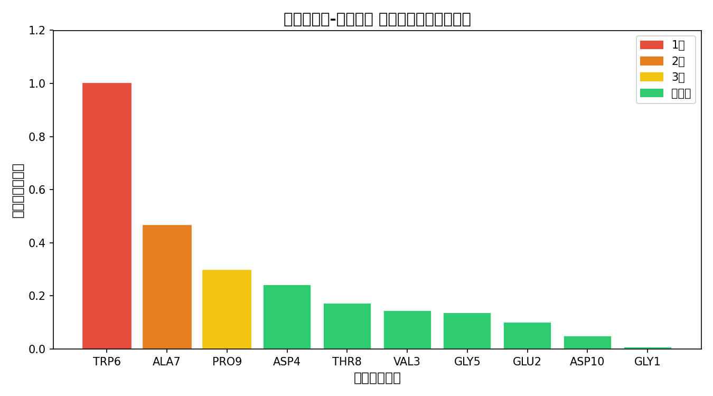
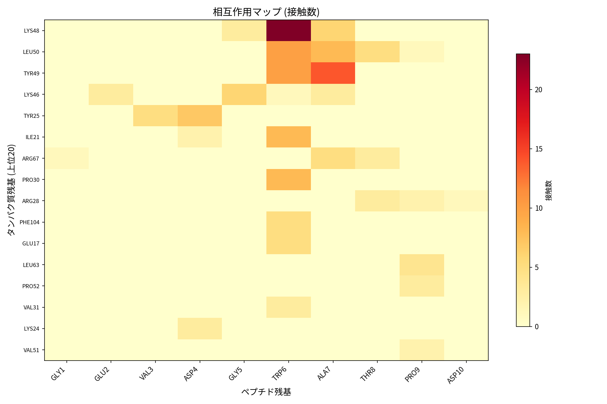
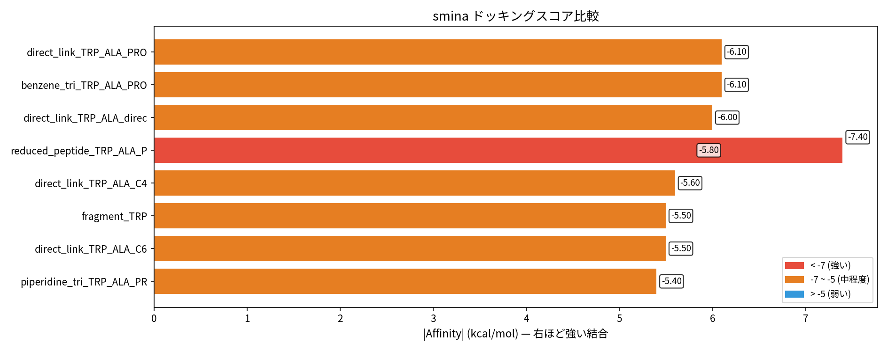
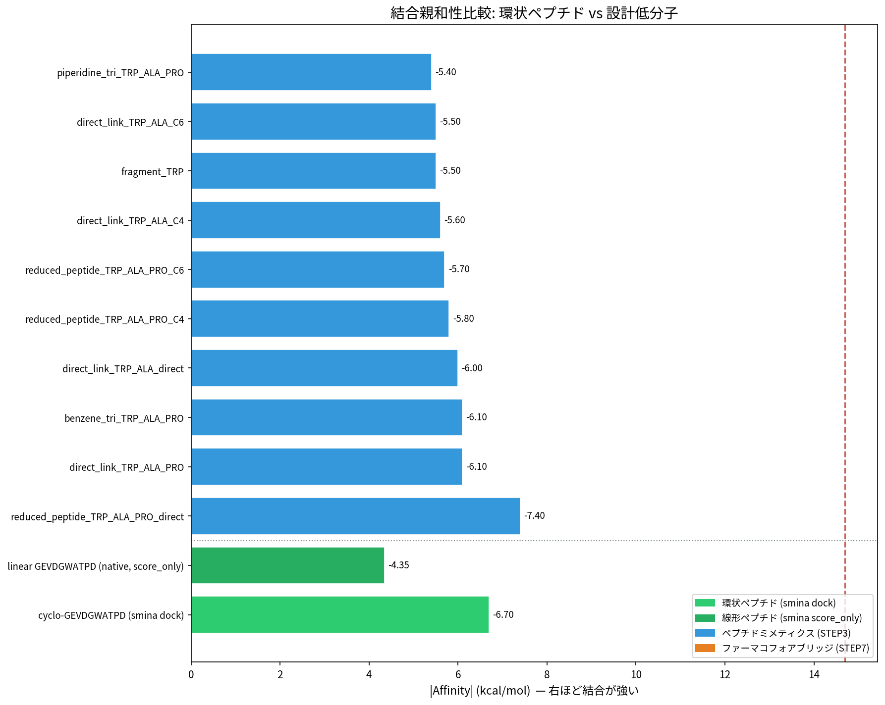

# Peptide to Small Molecule

ペプチド-タンパク質複合体の結合を保ちながら、ペプチドを低分子に変換するツールです。

---

## 1. 環境構築

```bash
# conda 環境を作成
conda create -n peptide_pipeline python=3.11 rdkit -c conda-forge -y
conda activate peptide_pipeline

# 必要パッケージをインストール
pip install biopython numpy scipy matplotlib pillow

# ドッキングエンジン (smina) をインストール
conda install -c conda-forge smina -y
```

### オプション: AI 逆合成 (AiZynthFinder)

より正確な合成ルートを提案させたい場合:

```bash
pip install aizynthfinder[all]
conda install -c conda-forge pytables -y
download_public_data aizynthfinder_data
```

---

## 2. 必要な入力

**PDB ファイル 1 つだけ** — タンパク質とペプチドが別チェーンで入った複合体構造。

サンプルファイル `Protein_Peptide.pdb` が同梱されているので、そのまま試せます。

---

## 3. 実行

```bash
conda activate peptide_pipeline

# サンプルで実行
python pipeline.py Protein_Peptide.pdb

# 自分の PDB で実行 (チェーン指定)
python pipeline.py my_complex.pdb --protein-chain A --peptide-chain B

# AI 逆合成を使う場合
python pipeline.py input.pdb --use-aizynthfinder
```

パイプライン完了後、上位候補の選抜と合成スキーム図を生成:

```bash
python collect_best.py
```

---

## 4. 結果

### `results/` — 全解析結果

- `contacts.json` — 相互作用データ
- `residue_scores.png` — 残基重要度グラフ
- `candidate_ligands.sdf` — 候補分子
- `docking/` — ドッキング結果 (スコア一覧 CSV + ポーズ SDF)

### `Result_Best/` — 上位 5 候補

- `*.sdf` — 選抜分子のドッキングポーズ (PyMOL で可視化)
- `summary.csv` — スコア・物性データ一覧
- `retrosynthesis/` — 合成スキーム図 (PNG) + HTML レポート

---

## 5. アウトプット例

サンプル PDB (`Protein_Peptide.pdb`) での実行結果です。

### 相互作用解析 — 残基重要度ランキング

ペプチドの各残基がタンパク質との結合にどれだけ重要かをスコア化します。



### 相互作用マップ

ペプチド残基とタンパク質残基の接触数をヒートマップで表示します。



### ドッキングスコア

設計された候補分子のドッキングスコア (kcal/mol) の比較です。値が小さいほど結合が強いことを示します。



### 上位 5 候補 (Result_Best)

| 順位 | 分子名 | スコア (kcal/mol) | LE | SA Score |
|:---:|--------|:---:|:---:|:---:|
| 1 | reduced_peptide_TRP_ALA_PRO_direct | -7.4 | 0.28 | 3.99 |
| 2 | direct_link_TRP_ALA_PRO | -6.1 | 0.38 | 3.88 |
| 3 | benzene_tri_TRP_ALA_PRO | -6.1 | 0.28 | 5.58 |
| 4 | direct_link_TRP_ALA_direct | -6.0 | 0.55 | 1.88 |
| 5 | reduced_peptide_TRP_ALA_PRO_C4 | -5.8 | 0.17 | 3.92 |

> **LE** (Ligand Efficiency) = |スコア| / 重原子数。0.3 以上が良好。
> **SA Score** = 合成容易性。1 (容易) 〜 10 (困難)。

### 環状ペプチド vs 設計低分子 — 結合親和性比較

元の環状ペプチド (cyclo-GEVDGWATPD) と設計低分子のドッキングスコアを比較します。低分子は原子数が少ないにもかかわらず、環状ペプチドに匹敵する結合スコアを示しています。



### 合成スキーム図 (AiZynthFinder)

AI が提案した前向き合成ルートの例です (1 位の分子、7 ステップ)。


---

## ライセンス

MIT License
