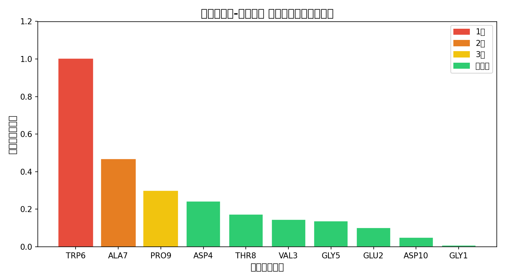
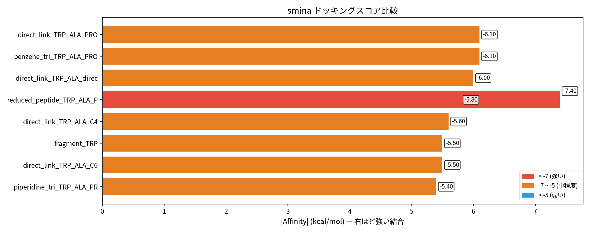

# Peptide to Small Molecule

ペプチド-タンパク質複合体の結合を保ちながら、ペプチドを低分子に変換するツールです。

---

## 1. 環境構築

```bash
# conda 環境を作成
conda create -n peptide_pipeline python=3.11 rdkit -c conda-forge -y
conda activate peptide_pipeline

# 必要パッケージをインストール
pip install biopython numpy scipy matplotlib pillow

# ドッキングエンジン (smina) をインストール
conda install -c conda-forge smina -y
```

### オプション: AI 逆合成 (AiZynthFinder)

より正確な合成ルートを提案させたい場合:

```bash
pip install aizynthfinder[all]
conda install -c conda-forge pytables -y
download_public_data aizynthfinder_data
```

---

## 2. 必要な入力

**PDB ファイル 1 つだけ** — タンパク質とペプチドが別チェーンで入った複合体構造。

サンプルファイル `Protein_Peptide.pdb` が同梱されているので、そのまま試せます。

---

## 3. 実行

```bash
conda activate peptide_pipeline

# サンプルで実行
python pipeline.py Protein_Peptide.pdb

# 自分の PDB で実行 (チェーン指定)
python pipeline.py my_complex.pdb --protein-chain A --peptide-chain B

# AI 逆合成を使う場合
python pipeline.py input.pdb --use-aizynthfinder
```

パイプライン完了後、上位候補の選抜と合成スキーム図を生成:

```bash
python collect_best.py
```

---

## 4. 結果

### `results/` — 全解析結果

- `contacts.json` — 相互作用データ
- `residue_scores.png` — 残基重要度グラフ
- `candidate_ligands.sdf` — 候補分子
- `docking/` — ドッキング結果 (スコア一覧 CSV + ポーズ SDF)

### `Result_Best/` — 上位 5 候補

- `*.sdf` — 選抜分子のドッキングポーズ (PyMOL で可視化)
- `summary.csv` — スコア・物性データ一覧
- `retrosynthesis/` — 合成スキーム図 (PNG) + HTML レポート

---

## 5. アウトプット例

サンプル PDB (`Protein_Peptide.pdb`) での実行結果です。

### 相互作用解析 — 残基重要度ランキング

ペプチドの各残基がタンパク質との結合にどれだけ重要かをスコア化します。



### 相互作用マップ

ペプチド残基とタンパク質残基の接触数をヒートマップで表示します。


### ドッキングスコア

設計された候補分子のドッキングスコア (kcal/mol) の比較です。値が小さいほど結合が強いことを示します。



### 上位 5 候補 (Result_Best)

| 順位 | 分子名 | スコア (kcal/mol) | LE | SA Score |
|:---:|--------|:---:|:---:|:---:|
| 1 | reduced_peptide_TRP_ALA_PRO_direct | -7.4 | 0.28 | 3.99 |
| 2 | direct_link_TRP_ALA_PRO | -6.1 | 0.38 | 3.88 |
| 3 | benzene_tri_TRP_ALA_PRO | -6.1 | 0.28 | 5.58 |
| 4 | direct_link_TRP_ALA_direct | -6.0 | 0.55 | 1.88 |
| 5 | reduced_peptide_TRP_ALA_PRO_C4 | -5.8 | 0.17 | 3.92 |

> **LE** (Ligand Efficiency) = |スコア| / 重原子数。0.3 以上が良好。
> **SA Score** = 合成容易性。1 (容易) 〜 10 (困難)。

### 環状ペプチド vs 設計低分子 — 結合親和性比較 (smina)

同じスコアリング関数 (smina / Vina スコア) で環状ペプチドと設計低分子を比較します。低分子は原子数が約 1/3 にもかかわらず、環状ペプチドに匹敵する結合スコアを示しています。


### 合成スキーム図 (AiZynthFinder)

AI が提案した前向き合成ルートの例です (1 位の分子、7 ステップ)。


---

## 6. 高度な機能

メインパイプライン以外にも、専門的な分子設計・評価機能を提供しています。

### ポケット分子生成

タンパク質ポケットの物理化学的性質に相補的な低分子を設計:

```bash
python generate_pocket_molecules.py
```

**特徴:**
- 残基タイプベース設計 (正電荷 ↔ 負電荷基、芳香族 ↔ π-π スタッキング)
- Anchor + Scaffold + Decorator 戦略
- ポケット特化型分子ライブラリ生成

### 剛直スキャフォールド設計

既知の剛直骨格を用いた制約付き分子設計:

```bash
python rigid_scaffold_design.py --point1 LYS48 --point2 LEU50
```

**特徴:**
- ベンゼン、ナフタレン、インドール、ピペラジン等の剛直スキャフォールド
- コンフォメーション適合性スコアリング
- ファーマコフォア間距離制約

### SASA (溶媒接触表面積) 解析

結合界面のホットスポット同定:

```bash
python analyze_sasa.py Protein_Peptide.pdb
```

**特徴:**
- ΔSASA解析による界面残基評価
- Shrake & Rupley アルゴリズム
- 複合体 vs 単体の定量比較

### ファーマコフォアブリッジ設計

指定残基ペア間の距離制約下での分子設計:

```bash
python pharmacophore_bridge.py --point1 LYS48 --point2 LEU50
```

**特徴:**
- RDKit 距離幾何学による制約付き3D埋め込み
- Cβ-Cβ距離ベースリンカー選択
- ユーザー指定残基ペア対応

### 高精度ドッキング評価

複数のドッキングエンジンによる多角的評価:

```bash
# AutoDock CrankPep (環状ペプチド専用)
python dock_cyclic_adcp.py

# AutoDock FR (低分子、物理ベーススコアリング)
python dock_smol_adfr.py

# PRODIGY (構造ベース結合親和性予測)
python analyze_prodigy.py

# 環状ペプチドとの統合比較
python compare_cyclic_peptide.py
```

**評価手法の比較:**

| 手法 | 適用対象 | スコア範囲 | 特徴 |
|------|---------|-----------|------|
| **smina** | 低分子 | -5〜-10 kcal/mol | 高速、相対比較向け |
| **ADCP** | 環状ペプチド | -10〜-35 kcal/mol | ペプチド専用、implicit溶媒 |
| **ADFR** | 低分子 | -5〜-15 kcal/mol | AutoDock力場、静電項含む |
| **PRODIGY** | 複合体 | 実験相関r=0.73 | 界面接触ベース予測 |

---

## ライセンス

MIT License
